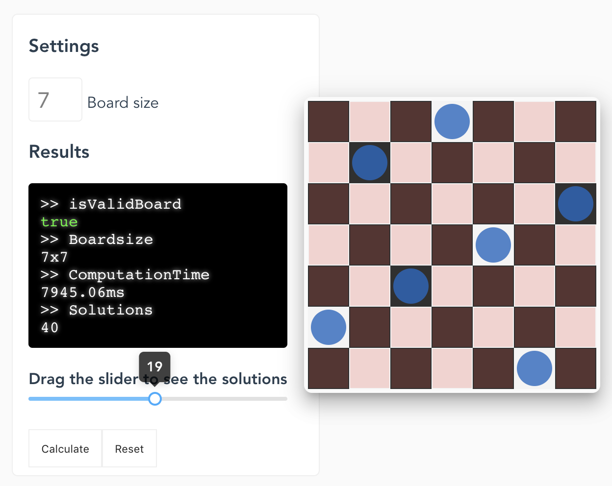

# QueensProblem: The last solution
The challenge is to place several queens on a board without any of them
able to hit another.

For this project the back-end will be hosted on heroku; which at the time of
writing is not able to calculate the solutions on a 8x8 chessboard using the 
algorithm currently provided.

The backend is written in PHP and the front-end is written in VueJS.
The cool thing about this solution is that it can calculate possible solutions
for any pre-set board.

Pre-set boards can be made by clicking on the chess-tiles in the interface.



## How to run
### Setup
First time setup is to install the dependencies:
```
composer install
```

In the frontend folder
```
npm install
```

### Development
For running the backend traverse to the `api` folder and run this command:
```php
php -S localhost:8000
```

For running the frontend traverse to the `frontend` folder and run this command:
```nodejs
npm run serve
```

### Deployment
Since the PHP backend is hosted on heroku, it can be deployed by pushing it 
to the heroku repository.
```
git push origin heroku
```


# Technical dept
This application was written in a rush, therefore has no quality guarantee.
It should be noted that the algorithm for calculating the possible solutions
is not optimized and could quite easily be improved by at least a factor 4.
